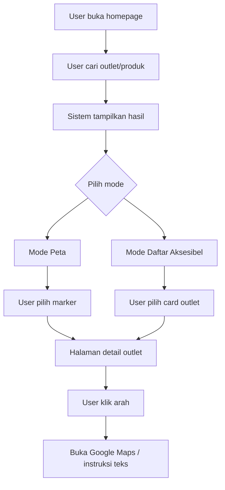
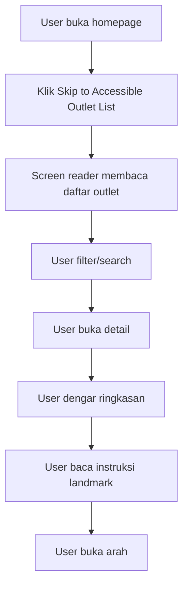
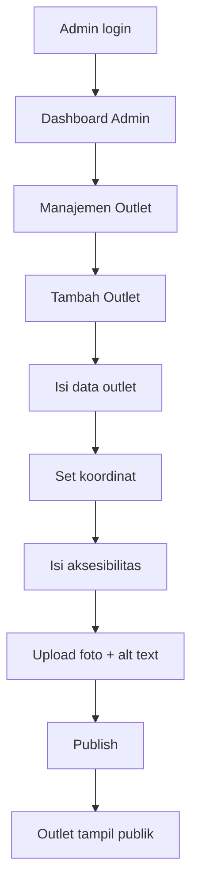
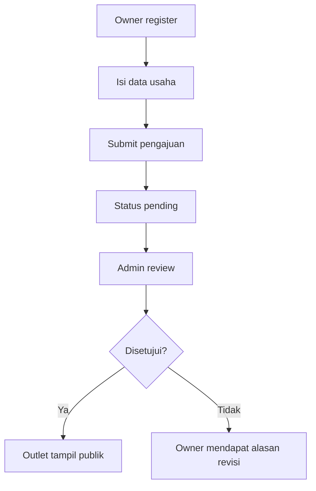
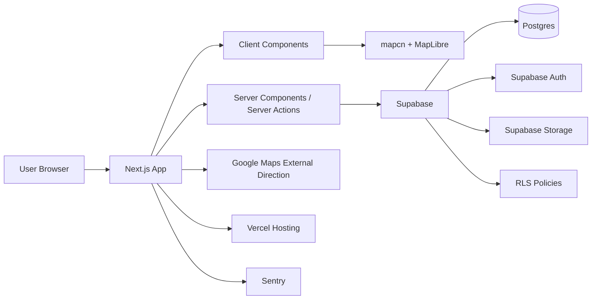

# Product Requirements Document (PRD)

# Sanan UMKM Maps

**Versi:** 1.0  
**Tanggal:** 1 Mei 2026  
**Status:** Draft lengkap  
**Lokasi cakupan:** Kampung/Sentra Sanan, Kelurahan Purwantoro, Kecamatan Blimbing, Kota Malang, Jawa Timur  
**Platform:** Responsive Web App  
**Target utama:** Pengguna umum, wisatawan, warga lokal, pengguna tunanetra/low vision, admin, dan pemilik UMKM

---

## Daftar Isi

1. [Ringkasan Produk](#1-ringkasan-produk)
2. [Latar Belakang](#2-latar-belakang)
3. [Visi Produk](#3-visi-produk)
4. [Tujuan Produk](#4-tujuan-produk)
5. [Non-Goals](#5-non-goals)
6. [Masalah yang Diselesaikan](#6-masalah-yang-diselesaikan)
7. [Target Pengguna dan Role](#7-target-pengguna-dan-role)
8. [Persona Pengguna](#8-persona-pengguna)
9. [Prinsip Produk](#9-prinsip-produk)
10. [Riset Aksesibilitas untuk Tunanetra](#10-riset-aksesibilitas-untuk-tunanetra)
11. [Scope Produk](#11-scope-produk)
12. [Struktur Halaman](#12-struktur-halaman)
13. [Fitur Berdasarkan Role](#13-fitur-berdasarkan-role)
14. [User Flow](#14-user-flow)
15. [Requirement Fungsional](#15-requirement-fungsional)
16. [Requirement Non-Fungsional](#16-requirement-non-fungsional)
17. [Aksesibilitas Detail](#17-aksesibilitas-detail)
18. [Tech Stack](#18-tech-stack)
19. [Arsitektur Sistem](#19-arsitektur-sistem)
20. [Struktur Folder Aplikasi](#20-struktur-folder-aplikasi)
21. [Model Data](#21-model-data)
22. [Supabase RLS dan Security Policy](#22-supabase-rls-dan-security-policy)
23. [API dan Server Actions](#23-api-dan-server-actions)
24. [Form, Validasi, dan Error Handling](#24-form-validasi-dan-error-handling)
25. [Peta, Marker, dan 360 View](#25-peta-marker-dan-360-view)
26. [Dashboard Admin](#26-dashboard-admin)
27. [Dashboard User](#27-dashboard-user)
28. [Dashboard Pemilik UMKM](#28-dashboard-pemilik-umkm)
29. [Analytics dan Success Metrics](#29-analytics-dan-success-metrics)
30. [Testing Plan](#30-testing-plan)
31. [Performance Plan](#31-performance-plan)
32. [Security Plan](#32-security-plan)
33. [SEO dan Metadata](#33-seo-dan-metadata)
34. [Roadmap](#34-roadmap)
35. [Prioritas Fitur](#35-prioritas-fitur)
36. [Acceptance Criteria Utama](#36-acceptance-criteria-utama)
37. [Risiko dan Mitigasi](#37-risiko-dan-mitigasi)
38. [Open Questions](#38-open-questions)
39. [Referensi](#39-referensi)

---

# 1. Ringkasan Produk

**Sanan UMKM Maps** adalah website pemetaan UMKM khusus kawasan Sanan, Malang, Jawa Timur. Konsep utama produk ini mirip direktori berbasis peta seperti Google Maps: terdapat pin untuk setiap outlet UMKM, pengguna dapat melihat informasi outlet, produk/menu, review, foto, status buka/tutup, kontak, dan arah menuju lokasi.

Produk ini juga memiliki konsep **Sanan 360 View**, yaitu pengalaman visual interaktif seperti street view menggunakan foto 360 derajat yang dikurasi sendiri oleh pengelola atau admin. Fitur ini tidak hanya menampilkan visual, tetapi juga wajib memiliki alternatif aksesibel berupa deskripsi teks dan/atau audio description.

Keunikan utama produk ini adalah aksesibilitas untuk pengguna tunanetra. Oleh karena itu, peta visual tidak boleh menjadi satu-satunya cara eksplorasi. Semua outlet harus dapat dijelajahi melalui **mode daftar aksesibel**, screen reader, navigasi keyboard, deskripsi lokasi berbasis landmark, dan instruksi arah berbasis teks.

---

# 2. Latar Belakang

Kampung Sanan di Kelurahan Purwantoro, Kecamatan Blimbing, Kota Malang dikenal sebagai sentra tempe dan keripik tempe yang berkembang turun-temurun. Diskopindag Kota Malang mencatat Sanan sebagai sentra penghasil tempe yang terkenal, sedangkan laman Pemkot Malang juga menyebut Kampung Sanan sebagai sentra industri tempe dan keripik tempe yang menjadi ikon Kota Malang.[^sanan-diskopindag][^sanan-pemkot]

Namun, informasi outlet UMKM di kawasan tersebut belum selalu tersedia dalam bentuk terpusat, mudah dicari, mudah diverifikasi, dan mudah diakses oleh semua kelompok pengguna. Banyak pengguna mungkin mengetahui Sanan sebagai kawasan oleh-oleh, tetapi belum tentu tahu outlet mana yang menjual produk tertentu, outlet mana yang buka, outlet mana yang menerima QRIS, atau bagaimana cara menemukan outlet di gang/kawasan kampung.

Website ini hadir sebagai solusi digitalisasi informasi UMKM Sanan berbasis lokasi dengan pendekatan inklusif.

---

# 3. Visi Produk

Menjadi platform digital pemetaan UMKM Sanan yang informatif, inklusif, mudah digunakan, dan membantu pengunjung menemukan outlet UMKM lokal secara cepat, akurat, dan aksesibel.

---

# 4. Tujuan Produk

## 4.1 Tujuan Pengguna

1. Membantu pengguna menemukan outlet UMKM di Sanan.
2. Membantu pengguna melihat produk/menu, harga, jam buka, foto, dan review.
3. Membantu pengguna mendapatkan arah menuju outlet.
4. Membantu pengguna tunanetra menjelajahi outlet tanpa bergantung pada peta visual.
5. Membantu wisatawan memahami kawasan Sanan melalui peta, daftar outlet, dan 360 view.

## 4.2 Tujuan UMKM

1. Meningkatkan visibilitas outlet UMKM.
2. Memudahkan pemilik usaha memperbarui informasi outlet.
3. Membantu calon pembeli menghubungi outlet via WhatsApp.
4. Menampilkan produk, menu, dan foto secara lebih profesional.

## 4.3 Tujuan Admin/Pengelola

1. Memiliki database outlet UMKM Sanan yang rapi dan tervalidasi.
2. Memoderasi review dan laporan data salah.
3. Mengelola data outlet, produk, foto, kategori, dan panorama 360.
4. Memantau statistik penggunaan platform.

## 4.4 Tujuan Sosial

1. Mendukung digitalisasi UMKM lokal.
2. Mendorong promosi Kampung Sanan sebagai sentra tempe/keripik tempe.
3. Mendorong akses informasi yang inklusif untuk pengguna tunanetra dan low vision.

---

# 5. Non-Goals

Versi awal produk tidak mencakup:

1. Marketplace penuh dengan pembayaran online.
2. Fitur pengiriman/logistik.
3. Pemetaan UMKM di luar kawasan Sanan.
4. Aplikasi mobile native Android/iOS.
5. Navigasi indoor presisi tinggi.
6. Integrasi AR navigation.
7. Street view global real-time seperti Google Street View.
8. Sistem POS untuk UMKM.
9. Manajemen stok produk kompleks.

---

# 6. Masalah yang Diselesaikan

| Masalah | Dampak | Solusi Produk |
|---|---|---|
| Informasi outlet UMKM tersebar | Pengunjung sulit menemukan outlet yang sesuai | Direktori outlet berbasis peta dan daftar |
| Lokasi outlet di kawasan gang/kampung sulit ditemukan | User bisa tersesat | Pin, landmark, instruksi arah teks, Google Maps direction |
| Peta visual tidak ramah tunanetra | Pengguna screen reader kesulitan | Mode daftar aksesibel dan deskripsi lokasi |
| Data outlet bisa usang | User mendapat informasi salah | Dashboard admin, laporan data salah, verifikasi |
| Foto/menu tidak terbaca screen reader | Informasi produk hilang | Alt text dan input menu berbasis teks |
| UMKM kurang eksposur digital | Potensi kunjungan dan pembelian rendah | Profil outlet, produk, review, WhatsApp CTA |
| Review tidak terpusat | Sulit menilai kualitas outlet | Sistem rating dan review internal |

---

# 7. Target Pengguna dan Role

## 7.1 User Umum

Pengunjung website yang ingin mencari outlet, melihat detail produk, membaca review, dan mendapatkan arah.

## 7.2 User Tunanetra / Low Vision

Pengguna yang mengakses website dengan screen reader, keyboard, voice assistant, pengaturan kontras tinggi, atau teks besar.

## 7.3 Admin

Pengelola sistem yang memiliki kewenangan penuh atas data outlet, user, review, kategori, laporan, dan konten 360 view.

## 7.4 Pemilik UMKM / Owner

Pemilik outlet yang dapat mengelola profil outlet miliknya setelah diverifikasi admin.

## 7.5 Guest

Pengguna tanpa login. Tetap dapat melihat peta, daftar outlet, detail outlet, dan arah, tetapi tidak dapat menulis review atau menyimpan favorit.

---

# 8. Persona Pengguna

## 8.1 Persona 1 — Wisatawan

**Nama:** Rina  
**Kebutuhan:** Mencari oleh-oleh keripik tempe di Sanan.  
**Masalah:** Tidak tahu outlet mana yang dekat, buka, dan populer.  
**Solusi:** Search produk, lihat rating, buka arah ke outlet.

## 8.2 Persona 2 — Pengguna Tunanetra

**Nama:** Arif  
**Kebutuhan:** Menemukan outlet tertentu tanpa mengandalkan tampilan peta.  
**Masalah:** Peta visual sulit digunakan dengan screen reader.  
**Solusi:** Mode daftar aksesibel, ringkasan audio, instruksi landmark, tombol arah yang jelas.

## 8.3 Persona 3 — Pemilik UMKM

**Nama:** Bu Sari  
**Kebutuhan:** Menampilkan produk, harga, jam buka, dan kontak WhatsApp.  
**Masalah:** Informasi usaha belum terdigitalisasi.  
**Solusi:** Dashboard owner untuk mengelola profil outlet.

## 8.4 Persona 4 — Admin

**Nama:** Pengelola Platform  
**Kebutuhan:** Mengelola data outlet dan memastikan data akurat.  
**Masalah:** Banyak data outlet perlu diverifikasi.  
**Solusi:** Dashboard admin, status verifikasi, laporan data salah, audit log.

---

# 9. Prinsip Produk

1. **Aksesibilitas sebagai fitur inti.** Produk harus bisa digunakan oleh pengguna tunanetra, bukan hanya pengguna visual.
2. **Peta bukan satu-satunya UI.** Semua informasi peta harus tersedia dalam daftar teks.
3. **Mobile-first.** Banyak pengguna akan membuka website saat sedang berada di Sanan.
4. **Data tervalidasi.** Outlet tampil publik setelah diverifikasi.
5. **Mudah dipelihara.** Admin dan owner harus bisa memperbarui data tanpa teknis rumit.
6. **Cepat dan ringan.** Peta dan 360 view harus lazy-loaded.
7. **Aman.** Gunakan validasi, RLS, role-based access, rate limiting, dan audit log.
8. **SEO-friendly.** Halaman detail outlet harus mudah ditemukan mesin pencari.

---

# 10. Riset Aksesibilitas untuk Tunanetra

## 10.1 Standar Aksesibilitas

Target minimal aksesibilitas adalah **WCAG 2.2 Level AA**. WCAG 2.2 mengelompokkan aksesibilitas dalam prinsip perceivable, operable, understandable, dan robust.[^wcag-overview]

Penerapannya pada produk ini:

1. Konten visual seperti foto outlet, foto produk, ikon, peta, dan 360 view harus memiliki alternatif teks.
2. Semua komponen interaktif harus bisa digunakan dengan keyboard.
3. Struktur heading harus jelas agar mudah dinavigasi screen reader.
4. Form harus memiliki label, pesan error, dan instruksi yang dapat dibaca screen reader.
5. Kontras warna harus memenuhi standar minimal.

## 10.2 Temuan Screen Reader

WebAIM Screen Reader User Survey #10 dilakukan pada Desember 2023 dan Januari 2024 dengan 1.539 responden valid.[^webaim-survey] Salah satu implikasi pentingnya adalah pengguna screen reader sering mengandalkan heading, label link/tombol, dan struktur halaman untuk menavigasi konten panjang. Oleh karena itu, PRD ini mewajibkan heading yang konsisten, landmark HTML, dan label tombol yang jelas.

## 10.3 Masalah Umum bagi Pengguna Tunanetra

1. Peta yang hanya bisa dipahami secara visual.
2. Marker/pin yang tidak memiliki label.
3. Foto produk tanpa alt text.
4. Menu makanan/produk hanya berbentuk gambar.
5. CAPTCHA visual.
6. Tombol dengan label tidak jelas seperti “klik di sini”.
7. Modal atau drawer yang tidak fokus ke konten aktif.
8. Form error yang hanya ditandai warna merah.
9. Animasi atau carousel yang tidak dapat dikontrol keyboard.

## 10.4 Solusi Aksesibilitas Produk

1. Sediakan **mode daftar aksesibel** sebagai alternatif utama peta.
2. Setiap outlet wajib memiliki deskripsi lokasi berbasis teks.
3. Setiap marker wajib memiliki accessible label.
4. Setiap gambar penting wajib memiliki alt text.
5. Setiap 360 view wajib memiliki deskripsi teks atau audio description.
6. Semua halaman utama harus bisa dinavigasi menggunakan keyboard.
7. Hindari CAPTCHA visual; gunakan OTP, magic link, honeypot, dan rate limit.
8. Sediakan pengaturan aksesibilitas seperti kontras tinggi, teks besar, dan reduced motion.

---

# 11. Scope Produk

## 11.1 MVP Scope

MVP harus mencakup:

1. Landing page.
2. Login dan register.
3. Role user dan admin.
4. Peta outlet UMKM Sanan.
5. Pin outlet dengan popup ringkas.
6. Halaman daftar outlet aksesibel.
7. Halaman detail outlet.
8. Produk/menu outlet.
9. Review dan rating.
10. Simpan favorit.
11. Dashboard user.
12. Dashboard admin.
13. CRUD outlet.
14. CRUD produk/menu.
15. Moderasi review.
16. Upload foto outlet/produk.
17. Alt text untuk foto.
18. Deskripsi akses lokasi.
19. Integrasi arah eksternal ke Google Maps.
20. 360 view dasar dengan deskripsi teks.

## 11.2 Post-MVP Scope

1. Dashboard pemilik UMKM.
2. Voice search.
3. Audio guide otomatis.
4. Rute wisata tematik Sanan.
5. QR code outlet.
6. Multi-bahasa Indonesia/Inggris/Jawa sederhana.
7. Statistik outlet untuk pemilik UMKM.
8. Integrasi WhatsApp template.
9. Validasi lokasi berbasis geofence.
10. Sistem badge ramah disabilitas.

---

# 12. Struktur Halaman

## 12.1 Halaman Depan

### Tujuan

Memperkenalkan platform dan memberi akses cepat ke peta, daftar outlet, pencarian, dan mode aksesibel.

### Komponen

1. Header
   - Logo
   - Navigasi: Beranda, Peta UMKM, Daftar Outlet, Tentang Sanan, Aksesibilitas, Login
   - Tombol “Mode Aksesibel”
2. Hero section
   - Judul: “Jelajahi UMKM Sanan Malang”
   - Subjudul: “Temukan outlet keripik tempe, oleh-oleh, kuliner, dan produk lokal Sanan.”
   - CTA utama: “Buka Peta”
   - CTA sekunder: “Buka Daftar Aksesibel”
3. Search bar
   - Cari outlet, produk, kategori, atau alamat
4. Highlight outlet
   - Outlet populer
   - Outlet terdekat
   - Outlet rating tertinggi
5. Section aksesibilitas
   - Penjelasan mode screen reader
   - Navigasi keyboard
   - Instruksi arah berbasis teks
6. Footer
   - Kontak
   - Panduan aksesibilitas
   - Kebijakan privasi
   - Ajukan UMKM

### Acceptance Criteria

- User bisa membuka peta dari homepage.
- User bisa membuka daftar outlet aksesibel dari homepage.
- Semua CTA bisa diakses dengan keyboard.
- Struktur heading valid dan konsisten.

---

## 12.2 Login/Register

### Tujuan

Memungkinkan user, owner, dan admin masuk sesuai role.

### Metode Auth

1. Email dan password.
2. Google OAuth.
3. Magic link, opsional.
4. WhatsApp/OTP, opsional post-MVP.

### Register User Umum

Field:

- Nama
- Email
- Password
- Konfirmasi password
- Persetujuan syarat penggunaan

### Register Owner UMKM

Field tambahan:

- Nama usaha
- Nama pemilik
- Nomor WhatsApp
- Alamat outlet
- Kategori produk
- Titik lokasi
- Foto outlet, opsional
- Dokumen pendukung, opsional

### Acceptance Criteria

- Form memiliki label eksplisit.
- Error dapat dibaca screen reader.
- Tidak menggunakan CAPTCHA visual.
- Setelah login, user diarahkan sesuai role.

---

## 12.3 Halaman Peta UMKM

### Tujuan

Menampilkan persebaran outlet UMKM Sanan secara interaktif.

### Komponen

1. Map canvas menggunakan mapcn dan MapLibre GL.
2. Marker outlet.
3. Marker cluster.
4. Popup ringkas outlet.
5. Search/filter panel.
6. List outlet di side panel/bottom sheet.
7. Tombol lokasi saya.
8. Tombol reset area Sanan.
9. Toggle “Peta” dan “Daftar Aksesibel”.
10. Tombol “Buka arah”.

### Filter

- Kategori produk
- Rating
- Status buka
- Fasilitas QRIS
- Ramah disabilitas
- Ada 360 view
- Menerima pesanan WhatsApp

### Acceptance Criteria

- Marker memiliki accessible label.
- Peta memiliki fallback daftar outlet.
- User bisa memilih outlet dengan keyboard.
- Jika peta gagal dimuat, daftar outlet tetap muncul.

---

## 12.4 Halaman Daftar Outlet Aksesibel

### Tujuan

Memberi alternatif utama bagi pengguna screen reader dan pengguna yang tidak ingin memakai peta visual.

### Komponen

1. Search outlet.
2. Filter berbasis form.
3. Sort by jarak, rating, nama, status buka.
4. Card outlet berbasis teks.
5. Tombol “Dengar ringkasan”.
6. Tombol “Buka detail”.
7. Tombol “Arahkan ke lokasi”.

### Data yang Ditampilkan per Outlet

- Nama outlet
- Kategori
- Rating
- Status buka/tutup
- Jarak dari lokasi user, jika izin lokasi aktif
- Alamat
- Patokan lokasi
- Ringkasan produk
- Info aksesibilitas lokasi

### Acceptance Criteria

- Semua outlet dapat dipilih tanpa peta.
- Struktur heading memudahkan navigasi screen reader.
- Tombol memiliki label jelas.

---

## 12.5 Halaman Detail Outlet

### Tujuan

Menampilkan informasi lengkap tentang satu outlet UMKM.

### Konten

1. Nama outlet.
2. Rating dan jumlah review.
3. Status buka/tutup.
4. Jam operasional.
5. Alamat lengkap.
6. Patokan lokasi.
7. Deskripsi akses untuk tunanetra.
8. Kontak WhatsApp.
9. Foto outlet.
10. Produk/menu.
11. Harga produk.
12. Foto produk dengan alt text.
13. Review.
14. 360 view.
15. Tombol arah.
16. Tombol favorit.
17. Tombol laporkan data salah.

### Acceptance Criteria

- Foto produk memiliki alt text.
- Informasi penting tersedia dalam teks, bukan hanya gambar.
- User login dapat menulis review.
- Guest dapat membaca review.

---

## 12.6 Dashboard User

### Tujuan

Memberi user area personal untuk mengelola profil, favorit, review, dan preferensi aksesibilitas.

### Fitur

1. Profil user.
2. Outlet favorit.
3. Riwayat review.
4. Preferensi aksesibilitas.
5. Laporan data salah yang pernah dikirim.
6. Ajukan outlet baru.

---

## 12.7 Dashboard Admin

### Tujuan

Mengelola seluruh data dan aktivitas platform.

### Menu

1. Overview.
2. Manajemen outlet.
3. Verifikasi pengajuan outlet.
4. Manajemen kategori.
5. Manajemen produk/menu.
6. Manajemen review.
7. Manajemen foto.
8. Manajemen 360 view.
9. Manajemen user.
10. Laporan data salah.
11. Statistik.
12. Audit log.
13. Accessibility completeness report.

---

## 12.8 Dashboard Pemilik UMKM

### Tujuan

Memungkinkan pemilik UMKM mengelola outlet miliknya.

### Fitur

1. Edit profil outlet.
2. Kelola jam buka.
3. Kelola produk/menu.
4. Upload foto produk.
5. Isi alt text.
6. Isi deskripsi akses lokasi.
7. Lihat review.
8. Balas review.
9. Ajukan perubahan titik pin.
10. Lihat statistik outlet.

---

# 13. Fitur Berdasarkan Role

| Fitur | Guest | User | Owner | Admin |
|---|---:|---:|---:|---:|
| Lihat homepage | Ya | Ya | Ya | Ya |
| Lihat peta | Ya | Ya | Ya | Ya |
| Lihat daftar outlet | Ya | Ya | Ya | Ya |
| Lihat detail outlet | Ya | Ya | Ya | Ya |
| Buka arah | Ya | Ya | Ya | Ya |
| Tulis review | Tidak | Ya | Ya* | Ya* |
| Simpan favorit | Tidak | Ya | Ya | Ya |
| Laporkan data salah | Ya | Ya | Ya | Ya |
| Ajukan outlet | Tidak | Ya | Ya | Ya |
| Kelola outlet sendiri | Tidak | Tidak | Ya | Ya |
| Verifikasi outlet | Tidak | Tidak | Tidak | Ya |
| Moderasi review | Tidak | Tidak | Tidak | Ya |
| Kelola user | Tidak | Tidak | Tidak | Ya |
| Lihat audit log | Tidak | Tidak | Tidak | Ya |

Catatan: Owner/admin tidak boleh menyalahgunakan review. Review internal owner terhadap outlet sendiri sebaiknya dibatasi atau diberi label khusus.

---

# 14. User Flow

## 14.1 Flow Mencari Outlet



## 14.2 Flow Pengguna Tunanetra



## 14.3 Flow Admin Menambah Outlet



## 14.4 Flow Owner Mengajukan Outlet



---

# 15. Requirement Fungsional

## 15.1 Outlet

Sistem harus mendukung:

1. Membuat outlet baru.
2. Mengedit outlet.
3. Menghapus/menonaktifkan outlet.
4. Verifikasi outlet.
5. Menampilkan outlet approved ke publik.
6. Menampilkan outlet pending hanya ke owner/admin.
7. Menampilkan outlet sebagai marker di peta.
8. Menampilkan outlet sebagai daftar aksesibel.
9. Menampilkan detail outlet.
10. Menampilkan status data lengkap/tidak lengkap.

## 15.2 Produk/Menu

Sistem harus mendukung:

1. Tambah produk/menu.
2. Edit produk/menu.
3. Hapus produk/menu.
4. Tampilkan harga.
5. Tampilkan status ketersediaan.
6. Upload foto produk.
7. Wajib alt text untuk foto produk.

## 15.3 Review

Sistem harus mendukung:

1. User login menulis review.
2. Rating 1–5.
3. Komentar teks.
4. Tag kualitas: rasa, harga, pelayanan, lokasi, aksesibilitas.
5. Moderasi review oleh admin.
6. Laporan review bermasalah.
7. Owner dapat membalas review.

## 15.4 Search dan Filter

Search harus mendukung:

1. Nama outlet.
2. Nama produk.
3. Kategori.
4. Alamat/gang.
5. Landmark.
6. Status buka.
7. Rating.
8. Fasilitas.
9. Ada/tidaknya 360 view.

## 15.5 Navigasi dan Rute

Sistem harus menyediakan:

1. Tombol buka arah di Google Maps.
2. Instruksi arah berbasis teks.
3. Patokan lokasi.
4. Jarak dari lokasi pengguna, jika izin lokasi diberikan.
5. Fallback jika user tidak mengizinkan lokasi.

## 15.6 360 View

Sistem harus mendukung:

1. Upload panorama 360.
2. Menampilkan panorama dalam viewer.
3. Lazy load panorama.
4. Deskripsi teks panorama.
5. Audio description, opsional.
6. Navigasi antar titik panorama, opsional post-MVP.

---

# 16. Requirement Non-Fungsional

## 16.1 Performance

1. Landing page LCP target < 2,5 detik.
2. Peta harus lazy-loaded.
3. 360 view tidak boleh auto-load.
4. Gambar menggunakan optimasi `next/image`.
5. Data outlet publik menggunakan caching.
6. Daftar outlet menggunakan pagination/infinite scroll.
7. Dashboard admin menggunakan client-side caching.

## 16.2 Accessibility

1. Target WCAG 2.2 Level AA.
2. Semua fitur utama bisa diakses keyboard.
3. Semua gambar informatif punya alt text.
4. Map punya alternatif daftar.
5. Marker punya accessible label.
6. Form punya label dan error message yang terbaca screen reader.
7. Tidak ada keyboard trap.
8. Fokus terlihat jelas.
9. Kontras memenuhi standar.
10. Support reduced motion.

## 16.3 Security

1. Auth menggunakan Supabase Auth.
2. Authorization menggunakan RLS.
3. Semua form divalidasi dengan Zod di client dan server.
4. File upload divalidasi MIME type, ukuran, dan ekstensi.
5. Rate limit untuk login, review, laporan, dan upload.
6. CSP dan security headers aktif.
7. Service role key hanya boleh dipakai di server.
8. Audit log untuk aksi penting.

## 16.4 Reliability

1. Jika peta gagal, daftar outlet tetap tersedia.
2. Jika 360 view gagal, deskripsi teks tetap tersedia.
3. Jika lokasi user ditolak, website tetap bisa digunakan.
4. Data penting tidak hilang saat refresh.

## 16.5 Privacy

1. Lokasi user hanya dipakai setelah izin eksplisit.
2. User bisa menggunakan website tanpa membagikan lokasi.
3. Email dan nomor HP user tidak tampil publik.
4. Data owner hanya ditampilkan sesuai izin.

---

# 17. Aksesibilitas Detail

## 17.1 Mode Daftar Aksesibel

Mode ini adalah fitur wajib, bukan tambahan.

Setiap card outlet harus berisi:

- Nama outlet
- Kategori
- Status buka
- Rating
- Alamat
- Landmark
- Deskripsi akses
- Produk utama
- Tombol detail
- Tombol arah
- Tombol dengar ringkasan

## 17.2 Deskripsi Lokasi Berbasis Teks

Setiap outlet wajib mengisi:

- Patokan terdekat
- Posisi relatif dari jalan/gapura/gang
- Kondisi jalan
- Titik turun kendaraan
- Informasi tangga/akses sempit
- Informasi parkir
- Instruksi pendek dari landmark utama

Contoh:

> Dari gapura Kampung Sanan, masuk lurus sekitar 120 meter. Outlet berada di sisi kanan jalan sebelum pertigaan kecil. Terdapat spanduk kuning di depan toko. Jalan cukup untuk motor, tetapi mobil perlu parkir di area depan gang.

## 17.3 Marker Aksesibel

Setiap marker harus memiliki label seperti:

> Outlet Keripik Tempe Bu Sari, rating 4,7, buka sekarang, sekitar 200 meter dari lokasi Anda.

## 17.4 Keyboard Navigation

Shortcut minimal:

| Tombol | Fungsi |
|---|---|
| Tab | Pindah fokus |
| Shift + Tab | Mundur fokus |
| Enter/Space | Aktifkan tombol/link |
| Esc | Tutup modal/drawer |
| Arrow keys | Navigasi item daftar/peta jika tersedia |
| + / - | Zoom map jika map fokus |

## 17.5 360 View Aksesibel

Setiap panorama harus memiliki:

1. Judul panorama.
2. Deskripsi teks.
3. Tombol lewati 360 view.
4. Tombol buka versi teks.
5. Audio description, jika tersedia.
6. Navigasi keyboard.

---

# 18. Tech Stack

## 18.1 Core Stack

| Area | Teknologi | Alasan |
|---|---|---|
| Framework | Next.js 16.x App Router | SSR, SSG, routing, Server Components, API routes, Server Actions, SEO |
| UI Library | React 19.x | Basis frontend modern untuk Next.js 16 |
| Language | TypeScript | Type safety untuk data outlet, koordinat, role, form, API |
| Backend/BaaS | Supabase | Postgres, Auth, Storage, RLS, API, Realtime, Edge Functions |
| Database | Supabase Postgres | Cocok untuk relasi outlet, produk, review, user, kategori |
| Auth | Supabase Auth + `@supabase/ssr` | Cookie-based auth untuk SSR Next.js |
| UI Components | shadcn/ui | Komponen UI modern, reusable, mudah dikustomisasi |
| Styling | Tailwind CSS | Cepat, responsif, cocok dengan shadcn/ui dan mapcn |
| Map UI | mapcn | Komponen peta React berbasis MapLibre GL, Tailwind, shadcn/ui[^mapcn] |
| Map Engine | MapLibre GL | Rendering peta interaktif |
| Form | React Hook Form | Form handling ringan dan fleksibel[^rhf] |
| Validation | Zod | TypeScript-first schema validation[^zod] |
| Form Resolver | `@hookform/resolvers/zod` | Integrasi React Hook Form dan Zod |

## 18.2 Frontend Stack

```txt
Next.js 16.x App Router
React 19.x
TypeScript
Tailwind CSS
shadcn/ui
Radix UI
lucide-react
next-themes
```

Next.js 16 digunakan karena mendukung App Router, Server Components, Route Handlers, Server Actions, metadata API, dan optimasi modern. Rilis Next.js 16 juga membawa peningkatan seperti Turbopack dan fitur terkait performa build/dev.[^next16][^next-turbopack]

## 18.3 Backend Stack

```txt
Supabase Postgres
Supabase Auth
Supabase Storage
Supabase Row Level Security
Supabase Edge Functions, opsional
Supabase Realtime, opsional
```

Supabase digunakan karena menyediakan integrasi cepat dengan Next.js, database Postgres, auth, storage, dan pola security berbasis RLS.[^supabase-next][^supabase-rls]

## 18.4 Map Stack

```txt
mapcn
MapLibre GL
Turf.js
OpenStreetMap / tile provider
Geolocation API
Google Maps external direction link
```

`mapcn` dipilih karena sesuai permintaan, berbasis React, MapLibre GL, Tailwind, dan kompatibel dengan shadcn/ui.[^mapcn]

## 18.5 Form dan Validasi

```txt
React Hook Form
Zod
@hookform/resolvers/zod
shadcn/ui Form
Server Actions / Route Handlers
```

shadcn/ui menyediakan panduan penggunaan React Hook Form dan Zod untuk membangun form dengan validasi, error handling, aksesibilitas, dan validasi client/server.[^shadcn-form]

## 18.6 Data Fetching dan State

```txt
TanStack Query
Next.js Server Components
Server Actions
nuqs
Zustand, opsional
```

Penggunaan:

- Server Components untuk halaman publik dan SEO.
- TanStack Query untuk dashboard dan interaksi peta.
- nuqs untuk menyimpan filter/search di URL.
- Zustand hanya untuk state map/filter kompleks bila diperlukan.

## 18.7 Performance Stack

```txt
next/image
dynamic import
Next.js caching
Vercel Analytics
Vercel Speed Insights
Sentry
sharp
```

## 18.8 Security Stack

```txt
Supabase RLS
Supabase Auth
Zod server validation
Upstash Redis Rate Limit
DOMPurify, jika ada rich text
Next.js security headers
Content Security Policy
Audit log table
File upload validation
```

CSP direkomendasikan untuk membantu mengurangi risiko XSS, clickjacking, dan code injection; Next.js memiliki panduan resmi untuk Content Security Policy.[^next-csp]

## 18.9 Testing Stack

```txt
Vitest
React Testing Library
Playwright
axe-core
jest-axe
Lighthouse
NVDA + Chrome manual test
TalkBack + Android manual test
VoiceOver + Safari manual test
```

---

# 19. Arsitektur Sistem

## 19.1 Diagram Arsitektur



## 19.2 Prinsip Arsitektur

1. Halaman publik dirender server-side untuk SEO dan performa.
2. Komponen peta dirender client-side karena membutuhkan interaksi browser.
3. Semua data publik hanya menampilkan outlet approved.
4. Semua mutation melewati validasi Zod.
5. Semua akses database dikendalikan RLS.
6. Storage Supabase dipakai untuk foto dan panorama.
7. Service role hanya digunakan di server untuk tugas admin tertentu.

---

# 20. Struktur Folder Aplikasi

```txt
src/
  app/
    (public)/
      page.tsx
      map/
        page.tsx
      outlets/
        page.tsx
      outlets/[slug]/
        page.tsx
      accessibility/
        page.tsx
      about/
        page.tsx

    (auth)/
      login/
        page.tsx
      register/
        page.tsx
      forgot-password/
        page.tsx

    dashboard/
      user/
        page.tsx
        favorites/
        reviews/
        accessibility-settings/
      admin/
        page.tsx
        outlets/
        categories/
        products/
        reviews/
        users/
        reports/
        analytics/
        audit-logs/
      owner/
        page.tsx
        outlet/
        products/
        reviews/
        analytics/

    api/
      upload/
      geocode/
      reports/
      webhooks/

  components/
    ui/
    layout/
    map/
      sanan-map.tsx
      outlet-marker.tsx
      outlet-popup.tsx
      outlet-cluster.tsx
      accessible-outlet-list.tsx
    outlet/
    forms/
    dashboard/
    accessibility/
    panorama/

  features/
    outlets/
      actions.ts
      queries.ts
      schema.ts
      types.ts
    products/
      actions.ts
      schema.ts
      types.ts
    reviews/
      actions.ts
      schema.ts
      types.ts
    auth/
      actions.ts
      schema.ts
    maps/
      utils.ts
      constants.ts

  lib/
    supabase/
      client.ts
      server.ts
      middleware.ts
      admin.ts
    validations/
    utils.ts
    constants.ts
    security.ts
    rate-limit.ts

  middleware.ts
```

---

# 21. Model Data

## 21.1 `profiles`

| Field | Type | Catatan |
|---|---|---|
| id | uuid | FK ke auth.users |
| name | text | Nama user |
| email | text | Email |
| phone | text | Opsional |
| role | enum | user, owner, admin |
| avatar_url | text | Opsional |
| accessibility_preferences | jsonb | Kontras, font, motion, audio |
| created_at | timestamptz | Otomatis |
| updated_at | timestamptz | Otomatis |

## 21.2 `outlets`

| Field | Type | Wajib | Catatan |
|---|---|---:|---|
| id | uuid | Ya | Primary key |
| owner_id | uuid | Tidak | FK profiles |
| name | text | Ya | Nama outlet |
| slug | text | Ya | SEO URL |
| description | text | Ya | Deskripsi outlet |
| address | text | Ya | Alamat lengkap |
| latitude | numeric | Ya | Koordinat |
| longitude | numeric | Ya | Koordinat |
| landmark_description | text | Ya | Patokan lokasi |
| accessibility_description | text | Ya | Instruksi akses tunanetra |
| whatsapp | text | Tidak | Kontak |
| opening_hours | jsonb | Ya | Jam buka per hari |
| status | enum | Ya | pending, approved, rejected, archived |
| is_accessibility_verified | boolean | Ya | Default false |
| created_at | timestamptz | Ya | Otomatis |
| updated_at | timestamptz | Ya | Otomatis |

## 21.3 `categories`

| Field | Type | Catatan |
|---|---|---|
| id | uuid | Primary key |
| name | text | Nama kategori |
| slug | text | URL slug |
| description | text | Opsional |

## 21.4 `outlet_categories`

| Field | Type | Catatan |
|---|---|---|
| outlet_id | uuid | FK outlets |
| category_id | uuid | FK categories |

## 21.5 `products`

| Field | Type | Catatan |
|---|---|---|
| id | uuid | Primary key |
| outlet_id | uuid | FK outlets |
| name | text | Nama produk |
| description | text | Deskripsi produk |
| price | integer | Harga dalam rupiah |
| category | text | Kategori produk |
| image_url | text | Opsional |
| image_alt | text | Wajib jika ada gambar |
| is_available | boolean | Default true |

## 21.6 `reviews`

| Field | Type | Catatan |
|---|---|---|
| id | uuid | Primary key |
| outlet_id | uuid | FK outlets |
| user_id | uuid | FK profiles |
| rating | integer | 1–5 |
| accessibility_rating | integer | 1–5 opsional |
| comment | text | Isi review |
| status | enum | pending, approved, hidden, deleted |
| created_at | timestamptz | Otomatis |

## 21.7 `photos`

| Field | Type | Catatan |
|---|---|---|
| id | uuid | Primary key |
| outlet_id | uuid | FK outlets |
| product_id | uuid | Opsional |
| url | text | Supabase Storage URL |
| alt_text | text | Wajib |
| type | enum | outlet, product, menu, panorama |
| created_at | timestamptz | Otomatis |

## 21.8 `panoramas`

| Field | Type | Catatan |
|---|---|---|
| id | uuid | Primary key |
| outlet_id | uuid | FK outlets |
| title | text | Judul panorama |
| image_360_url | text | URL gambar 360 |
| text_description | text | Wajib |
| audio_description_url | text | Opsional |
| latitude | numeric | Opsional |
| longitude | numeric | Opsional |
| heading | numeric | Opsional |
| order_index | integer | Urutan |

## 21.9 `favorites`

| Field | Type | Catatan |
|---|---|---|
| id | uuid | Primary key |
| user_id | uuid | FK profiles |
| outlet_id | uuid | FK outlets |
| created_at | timestamptz | Otomatis |

## 21.10 `reports`

| Field | Type | Catatan |
|---|---|---|
| id | uuid | Primary key |
| user_id | uuid | Opsional untuk guest |
| outlet_id | uuid | FK outlets |
| type | enum | wrong_location, wrong_hours, abusive_review, accessibility_issue, other |
| description | text | Isi laporan |
| status | enum | open, in_review, resolved, rejected |
| created_at | timestamptz | Otomatis |

## 21.11 `audit_logs`

| Field | Type | Catatan |
|---|---|---|
| id | uuid | Primary key |
| actor_id | uuid | User pelaku |
| action | text | create/update/delete/approve/reject |
| entity_type | text | outlets/products/reviews/etc |
| entity_id | uuid | ID terkait |
| before | jsonb | Data sebelum |
| after | jsonb | Data sesudah |
| created_at | timestamptz | Otomatis |

---

# 22. Supabase RLS dan Security Policy

Supabase RLS digunakan sebagai lapisan authorization utama. RLS adalah fitur Postgres yang dapat dikombinasikan dengan Supabase Auth untuk mengontrol akses baris data berdasarkan user dan role.[^supabase-rls]

## 22.1 Role

```txt
user
owner
admin
```

## 22.2 Policy Minimum

| Tabel | Policy |
|---|---|
| profiles | User hanya bisa read/update profil sendiri. Admin bisa read user terbatas. |
| outlets | Publik hanya read outlet approved. Owner bisa update outlet miliknya. Admin bisa semua. |
| products | Publik read produk dari outlet approved. Owner CRUD produk outlet miliknya. Admin bisa semua. |
| reviews | Publik read review approved. User create review. User edit/delete review sendiri. Admin moderasi. |
| photos | Publik read foto outlet approved. Owner/admin manage sesuai hak akses. |
| panoramas | Publik read panorama outlet approved. Owner/admin manage sesuai hak akses. |
| favorites | User hanya bisa CRUD favorit miliknya. |
| reports | Guest/user create laporan. Admin read/update status. |
| audit_logs | Hanya admin read. Insert otomatis oleh server-side action. |

## 22.3 Prinsip Supabase API Security

Supabase Data API bekerja dengan grant Postgres dan RLS; grant menentukan role yang dapat menyentuh tabel/fungsi, sedangkan RLS menentukan baris mana yang dapat dibaca/diubah.[^supabase-api-security]

Aturan penting:

1. Aktifkan RLS di semua tabel publik.
2. Jangan pernah mengandalkan validasi client saja.
3. Gunakan service role hanya di server.
4. Gunakan publishable/anon key hanya untuk client.
5. Review policy anon dan authenticated secara rutin.
6. Gunakan migration SQL untuk menjaga policy konsisten.

---

# 23. API dan Server Actions

## 23.1 Public Queries

| Query | Fungsi |
|---|---|
| `getApprovedOutlets` | Mengambil outlet approved |
| `getOutletBySlug` | Mengambil detail outlet |
| `searchOutlets` | Search dan filter outlet |
| `getOutletReviews` | Mengambil review approved |
| `getOutletProducts` | Mengambil produk outlet |

## 23.2 Authenticated Actions

| Action | Fungsi |
|---|---|
| `createReview` | Membuat review |
| `updateReview` | Mengedit review milik sendiri |
| `deleteReview` | Menghapus review milik sendiri |
| `toggleFavorite` | Simpan/hapus favorit |
| `createReport` | Melaporkan data salah |
| `updateProfile` | Update profil |
| `updateAccessibilityPreferences` | Update preferensi aksesibilitas |

## 23.3 Owner Actions

| Action | Fungsi |
|---|---|
| `updateOwnOutlet` | Update outlet milik owner |
| `createProduct` | Tambah produk outlet milik owner |
| `updateProduct` | Edit produk outlet milik owner |
| `deleteProduct` | Hapus produk outlet milik owner |
| `requestLocationChange` | Ajukan perubahan pin |
| `replyToReview` | Balas review |

## 23.4 Admin Actions

| Action | Fungsi |
|---|---|
| `createOutlet` | Tambah outlet |
| `updateOutlet` | Edit outlet |
| `approveOutlet` | Verifikasi outlet |
| `rejectOutlet` | Tolak outlet |
| `archiveOutlet` | Arsipkan outlet |
| `moderateReview` | Moderasi review |
| `manageUserRole` | Ubah role user |
| `resolveReport` | Selesaikan laporan |
| `createCategory` | Tambah kategori |
| `updateCategory` | Edit kategori |

---

# 24. Form, Validasi, dan Error Handling

## 24.1 Stack Form

Semua form menggunakan:

```txt
shadcn/ui Form
React Hook Form
Zod
@hookform/resolvers/zod
Server Actions / Route Handlers
Supabase
```

## 24.2 Form yang Wajib Ada

1. Login.
2. Register.
3. Forgot password.
4. Tambah outlet.
5. Edit outlet.
6. Tambah produk.
7. Edit produk.
8. Tulis review.
9. Laporkan data salah.
10. Update profil.
11. Update preferensi aksesibilitas.
12. Upload foto.
13. Tambah 360 view.

## 24.3 Contoh Zod Schema

```ts
import { z } from "zod"

export const outletSchema = z.object({
  name: z.string().min(3, "Nama outlet minimal 3 karakter"),
  description: z.string().min(20, "Deskripsi minimal 20 karakter"),
  address: z.string().min(10, "Alamat terlalu pendek"),
  latitude: z.number().min(-90).max(90),
  longitude: z.number().min(-180).max(180),
  landmarkDescription: z.string().min(10, "Patokan lokasi wajib diisi"),
  accessibilityDescription: z.string().min(20, "Deskripsi aksesibilitas wajib diisi"),
  whatsapp: z.string().optional(),
  categoryIds: z.array(z.string()).min(1, "Pilih minimal satu kategori"),
})
```

## 24.4 Error Handling

1. Error field ditampilkan dekat input.
2. Error summary ditampilkan di atas form.
3. Error memiliki `aria-live="polite"`.
4. Fokus diarahkan ke error pertama saat submit gagal.
5. Pesan error tidak hanya mengandalkan warna.

---

# 25. Peta, Marker, dan 360 View

## 25.1 Peta

Peta menggunakan `mapcn` dan MapLibre GL. `mapcn` adalah komponen peta React yang open-source, zero config, berbasis MapLibre GL, Tailwind, dan kompatibel dengan shadcn/ui.[^mapcn]

## 25.2 Marker

Marker harus memiliki:

1. Nama outlet.
2. Status buka.
3. Rating.
4. Kategori.
5. Accessible label.
6. Keyboard focus.
7. Popup ringkas.

Google Maps Platform juga mendokumentasikan praktik marker aksesibel seperti click event, teks deskriptif untuk screen reader, dan penyesuaian ukuran marker.[^google-accessible-marker] Walaupun produk ini memakai mapcn/MapLibre, prinsip aksesibilitas tersebut tetap relevan.

## 25.3 Cluster

Jika banyak outlet berdekatan:

1. Marker digabung sebagai cluster.
2. Cluster memiliki label seperti “12 outlet di area ini”.
3. Klik cluster memperbesar area.
4. Daftar outlet tetap tersedia.

## 25.4 360 View

Untuk MVP, disarankan menggunakan foto 360 milik sendiri yang disimpan di Supabase Storage. Google Street View Static API dapat menampilkan panorama/thumbnail non-interaktif, tetapi membutuhkan API key, billing, dan setiap request berbiaya.[^google-streetview]

Rekomendasi:

1. Gunakan **Sanan 360 View** berbasis foto sendiri.
2. Simpan panorama di Supabase Storage.
3. Viewer 360 lazy-loaded.
4. Setiap panorama punya deskripsi teks.
5. Setiap panorama bisa dilewati oleh pengguna screen reader.

---

# 26. Dashboard Admin

## 26.1 Overview

Menampilkan:

- Total outlet.
- Outlet pending.
- Total user.
- Total review.
- Total laporan terbuka.
- Outlet paling banyak dilihat.
- Persentase outlet dengan deskripsi aksesibilitas lengkap.

## 26.2 Manajemen Outlet

Fitur:

1. Tabel outlet.
2. Search/filter outlet.
3. Tambah outlet.
4. Edit outlet.
5. Arsipkan outlet.
6. Verifikasi outlet.
7. Lihat kelengkapan data.
8. Lihat preview publik.

## 26.3 Accessibility Completeness Report

Admin dapat melihat outlet yang belum memiliki:

- Alt text foto.
- Deskripsi akses lokasi.
- Landmark.
- Jam buka.
- Kontak.
- Produk/menu.
- 360 view description.

## 26.4 Moderasi Review

Admin dapat:

1. Menyetujui review.
2. Menyembunyikan review.
3. Menghapus review spam.
4. Menandai review bermasalah.
5. Melihat laporan review.

---

# 27. Dashboard User

## 27.1 Profil

User dapat mengubah:

- Nama.
- Foto profil.
- Nomor telepon.
- Password.

## 27.2 Favorit

User dapat:

- Melihat outlet favorit.
- Menghapus favorit.
- Membuka detail outlet.
- Membuka arah.

## 27.3 Review Saya

User dapat:

- Melihat review yang pernah ditulis.
- Mengedit review.
- Menghapus review.

## 27.4 Preferensi Aksesibilitas

User dapat mengatur:

- Mode kontras tinggi.
- Ukuran teks besar.
- Reduced motion.
- Mode daftar sebagai default.
- Audio guide aktif/nonaktif.
- Instruksi arah berbasis teks sebagai default.

---

# 28. Dashboard Pemilik UMKM

## 28.1 Profil Outlet

Owner dapat mengelola:

- Nama outlet.
- Deskripsi.
- Alamat.
- Kontak WhatsApp.
- Jam buka.
- Patokan lokasi.
- Deskripsi aksesibilitas.

## 28.2 Produk/Menu

Owner dapat:

- Tambah produk.
- Edit produk.
- Hapus produk.
- Upload foto.
- Isi alt text.
- Tandai produk tersedia/tidak tersedia.

## 28.3 Review

Owner dapat:

- Membaca review.
- Membalas review.
- Melaporkan review bermasalah.

## 28.4 Perubahan Sensitif

Perubahan berikut harus masuk approval admin:

1. Titik koordinat outlet.
2. Nama outlet.
3. Status outlet.
4. Klaim kepemilikan outlet.

---

# 29. Analytics dan Success Metrics

## 29.1 Product Metrics

| Metric | Target MVP |
|---|---:|
| Outlet terdaftar | 10–20 outlet awal |
| Outlet approved | >= 90% dari data awal |
| Klik arah | Diukur harian |
| Search per hari | Diukur harian |
| Review terkirim | Diukur mingguan |
| Favorit tersimpan | Diukur mingguan |
| Report data salah | Diukur dan ditindaklanjuti |

## 29.2 Accessibility Metrics

| Metric | Target |
|---|---:|
| Halaman utama bisa diakses keyboard | 100% |
| Gambar informatif punya alt text | 100% |
| Outlet punya deskripsi akses lokasi | 100% |
| Keyboard trap | 0 |
| Form punya label | 100% |
| Audit axe-core kritikal | 0 issue |

## 29.3 UMKM Metrics

| Metric | Tujuan |
|---|---|
| Klik WhatsApp | Mengukur minat pembelian |
| View detail outlet | Mengukur visibilitas outlet |
| View produk | Mengukur minat produk |
| Klik arah | Mengukur potensi kunjungan fisik |

---

# 30. Testing Plan

## 30.1 Unit Test

Tool: Vitest

Cakupan:

- Zod schema.
- Utility jarak lokasi.
- Format jam buka.
- Role helper.
- Slug generator.

## 30.2 Component Test

Tool: React Testing Library

Cakupan:

- Form login/register.
- Outlet card.
- Review form.
- Filter panel.
- Accessible outlet list.

## 30.3 E2E Test

Tool: Playwright

Flow:

1. Guest membuka homepage.
2. Guest mencari outlet.
3. Guest membuka detail outlet.
4. User register/login.
5. User menulis review.
6. Admin login.
7. Admin menambah outlet.
8. Admin memverifikasi outlet.

## 30.4 Accessibility Test

Tool:

- axe-core.
- jest-axe.
- Lighthouse.
- NVDA + Chrome.
- TalkBack + Android.
- VoiceOver + Safari.

Checklist manual:

1. Navigasi semua halaman hanya dengan keyboard.
2. Screen reader membaca heading dengan benar.
3. Screen reader membaca marker/list outlet dengan jelas.
4. Error form diumumkan.
5. Modal/drawer mengunci fokus dengan benar dan bisa ditutup.

---

# 31. Performance Plan

1. Landing page menggunakan Server Components.
2. Peta menggunakan dynamic import dengan `ssr: false` bila perlu.
3. 360 viewer lazy-loaded.
4. Foto menggunakan `next/image`.
5. Thumbnail dibuat untuk foto besar.
6. Query outlet dipaginasi.
7. Gunakan bounding box query untuk data peta.
8. Gunakan caching untuk outlet approved.
9. Gunakan TanStack Query untuk client cache dashboard.
10. Gunakan Sentry dan Speed Insights untuk monitoring.

---

# 32. Security Plan

1. Supabase RLS aktif di semua tabel.
2. Role-based access di database dan server.
3. Validasi Zod di client dan server.
4. Rate limit:
   - Login.
   - Register.
   - Review.
   - Report.
   - Upload.
5. File upload:
   - Validasi MIME.
   - Validasi ukuran file.
   - Validasi ekstensi.
   - Kompresi gambar.
6. CSP:
   - Batasi sumber script.
   - Batasi sumber image.
   - Batasi koneksi ke Supabase/map tile provider.
7. Audit log:
   - Approve/reject outlet.
   - Update role user.
   - Delete review.
   - Update koordinat outlet.
8. Jangan simpan token sensitif di local storage.
9. Gunakan cookie-based SSR auth dengan Supabase SSR.

---

# 33. SEO dan Metadata

## 33.1 Halaman yang Perlu SEO

1. Homepage.
2. Halaman daftar outlet.
3. Halaman detail outlet.
4. Halaman kategori produk.
5. Halaman tentang Sanan.

## 33.2 Metadata Outlet

Setiap detail outlet harus memiliki:

- Title: `{Nama Outlet} - UMKM Sanan Malang`
- Description: ringkasan outlet dan produk utama.
- Open Graph image.
- Canonical URL.
- Structured data LocalBusiness, jika memungkinkan.

## 33.3 URL Structure

```txt
/
/map
/outlets
/outlets/[slug]
/categories/[slug]
/accessibility
/about-sanan
/login
/register
/dashboard/user
/dashboard/admin
/dashboard/owner
```

---

# 34. Roadmap

## Phase 1 — Discovery dan Data Awal

Durasi rekomendasi: 1–2 minggu

Deliverable:

1. Validasi kebutuhan pengguna.
2. Pendataan outlet awal.
3. Definisi kategori.
4. Desain wireframe.
5. Validasi aksesibilitas awal.

## Phase 2 — MVP Foundation

Durasi rekomendasi: 2–4 minggu

Deliverable:

1. Setup Next.js + Supabase.
2. Auth.
3. Database schema.
4. RLS policy awal.
5. Landing page.
6. Daftar outlet.
7. Detail outlet.

## Phase 3 — Map dan Outlet Management

Durasi rekomendasi: 2–3 minggu

Deliverable:

1. mapcn integration.
2. Marker outlet.
3. Search/filter map.
4. Dashboard admin outlet CRUD.
5. Upload foto.

## Phase 4 — Review, Accessibility, dan Dashboard User

Durasi rekomendasi: 2–3 minggu

Deliverable:

1. Review dan rating.
2. Favorit.
3. Dashboard user.
4. Mode daftar aksesibel.
5. Preferensi aksesibilitas.
6. Audit keyboard dan screen reader.

## Phase 5 — 360 View dan Polish

Durasi rekomendasi: 2–3 minggu

Deliverable:

1. Upload panorama.
2. Viewer 360.
3. Deskripsi teks panorama.
4. Audio description opsional.
5. Performance optimization.
6. Security hardening.

## Phase 6 — Owner Dashboard dan Advanced Features

Post-MVP:

1. Dashboard owner.
2. Rute wisata tematik.
3. QR code outlet.
4. Voice search.
5. Analytics owner.

---

# 35. Prioritas Fitur

## Must Have

1. Homepage.
2. Login/register.
3. Peta outlet.
4. Pin/marker outlet.
5. Detail outlet.
6. Daftar outlet aksesibel.
7. Search/filter outlet.
8. Review/rating.
9. Dashboard admin.
10. Dashboard user.
11. CRUD outlet.
12. CRUD produk.
13. Alt text foto.
14. Deskripsi akses lokasi.
15. RLS dan role-based access.

## Should Have

1. Dashboard owner.
2. 360 view.
3. Audio description.
4. Favorit outlet.
5. Laporkan data salah.
6. WhatsApp CTA.
7. Statistik admin.
8. Completeness score.

## Could Have

1. Voice search.
2. QR code outlet.
3. Rute wisata tematik.
4. Multi-bahasa.
5. Rekomendasi outlet.
6. Event UMKM Sanan.

## Won't Have di MVP

1. Pembayaran online.
2. Pengiriman/logistik.
3. AR navigation.
4. Mobile native app.
5. POS UMKM.

---

# 36. Acceptance Criteria Utama

MVP dianggap selesai jika:

1. Pengguna dapat membuka homepage.
2. Pengguna dapat melihat peta outlet Sanan.
3. Pengguna dapat melihat daftar outlet aksesibel.
4. Pengguna dapat search dan filter outlet.
5. Pengguna dapat membuka detail outlet.
6. Pengguna dapat melihat produk/menu outlet.
7. Pengguna dapat membaca review.
8. User login dapat menulis review.
9. User login dapat menyimpan favorit.
10. Pengguna dapat membuka arah ke lokasi.
11. Admin dapat CRUD outlet.
12. Admin dapat verifikasi outlet.
13. Admin dapat moderasi review.
14. Admin dapat mengelola kategori dan produk.
15. Setiap foto informatif memiliki alt text.
16. Setiap outlet memiliki deskripsi akses lokasi.
17. Semua halaman utama bisa dinavigasi dengan keyboard.
18. Tidak ada issue aksesibilitas kritikal dari axe-core.
19. RLS aktif di semua tabel penting.
20. Semua form tervalidasi dengan Zod di client dan server.

---

# 37. Risiko dan Mitigasi

| Risiko | Dampak | Mitigasi |
|---|---|---|
| Data lokasi tidak akurat | User tersesat | Verifikasi admin, laporan data salah, titik pin manual |
| Peta tidak aksesibel | Pengguna tunanetra kesulitan | Mode daftar aksesibel wajib |
| Foto/menu tanpa alt text | Informasi hilang bagi screen reader | Alt text wajib saat upload |
| Map tile provider bermasalah | Peta gagal dimuat | Fallback daftar outlet |
| 360 view berat | Website lambat | Lazy load dan kompresi gambar |
| Review spam | Kepercayaan turun | Rate limit dan moderasi |
| RLS salah konfigurasi | Data bocor | Review policy, testing, migration SQL |
| Owner salah update lokasi | User tersesat | Perubahan koordinat harus approval admin |
| API cost meningkat | Biaya membengkak | Gunakan open-source map stack dan batasi Google API |

---

# 38. Open Questions

1. Apakah data outlet awal akan dikumpulkan manual atau dari database resmi?
2. Apakah semua owner UMKM akan diberi akun sendiri sejak MVP?
3. Apakah 360 view dibuat per outlet atau hanya di titik-titik utama kawasan?
4. Apakah perlu integrasi WhatsApp OTP atau cukup email/password?
5. Apakah admin satu orang atau multi-admin?
6. Apakah user guest boleh mengirim laporan data salah tanpa login?
7. Apakah harga produk wajib diisi atau boleh “mulai dari”?
8. Apakah perlu validasi legal dari UMKM sebelum outlet tampil publik?
9. Tile provider peta apa yang akan dipakai untuk production?
10. Apakah akan ada dukungan multi-bahasa sejak MVP?

---

# 39. Referensi

[^sanan-diskopindag]: Diskopindag Kota Malang, “Sentra Industri - Keripik Tempe”, https://diskopindag.malangkota.go.id/industry/Keripik%20Tempe

[^sanan-pemkot]: Pemerintah Kota Malang, “Jadi Potensi Unggulan, Pj. Wali Kota Sambangi Sentra Industri Tempe Sanan”, https://malangkota.go.id/2024/06/15/jadi-potensi-unggulan-pj-wali-kota-sambangi-sentra-industri-tempe-sanan/

[^wcag-overview]: W3C WAI, “WCAG 2 Overview”, https://www.w3.org/WAI/standards-guidelines/wcag/

[^wcag22]: W3C, “Web Content Accessibility Guidelines (WCAG) 2.2”, https://www.w3.org/TR/WCAG22/

[^webaim-survey]: WebAIM, “Screen Reader User Survey #10 Results”, https://webaim.org/projects/screenreadersurvey10/

[^next16]: Next.js, “Next.js 16”, https://nextjs.org/blog/next-16

[^next-turbopack]: Next.js Docs, “Turbopack”, https://nextjs.org/docs/app/api-reference/turbopack

[^supabase-next]: Supabase Docs, “Use Supabase with Next.js”, https://supabase.com/docs/guides/getting-started/quickstarts/nextjs

[^supabase-ssr]: Supabase Docs, “Creating a Supabase client for SSR”, https://supabase.com/docs/guides/auth/server-side/creating-a-client?queryGroups=framework&framework=nextjs

[^supabase-rls]: Supabase Docs, “Row Level Security”, https://supabase.com/docs/guides/database/postgres/row-level-security

[^supabase-api-security]: Supabase Docs, “Securing your API”, https://supabase.com/docs/guides/api/securing-your-api

[^mapcn]: GitHub, AnmolSaini16/mapcn, https://github.com/AnmolSaini16/mapcn

[^rhf]: React Hook Form, https://react-hook-form.com/

[^zod]: Zod Docs, https://zod.dev/

[^shadcn-form]: shadcn/ui Docs, “React Hook Form”, https://ui.shadcn.com/docs/forms/react-hook-form

[^next-csp]: Next.js Docs, “Content Security Policy”, https://nextjs.org/docs/app/guides/content-security-policy

[^google-accessible-marker]: Google Maps Platform Docs, “Make markers clickable and accessible”, https://developers.google.com/maps/documentation/javascript/advanced-markers/accessible-markers

[^google-streetview]: Google Maps Platform Docs, “Street View Static API overview”, https://developers.google.com/maps/documentation/streetview/overview
